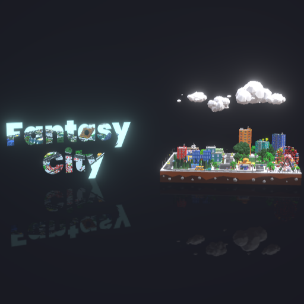
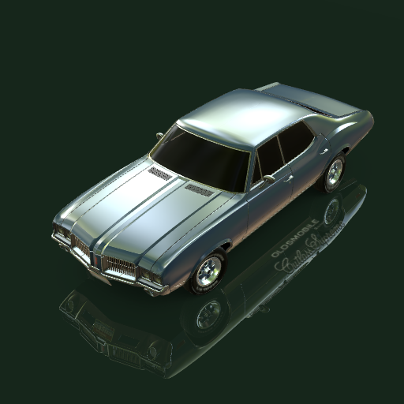
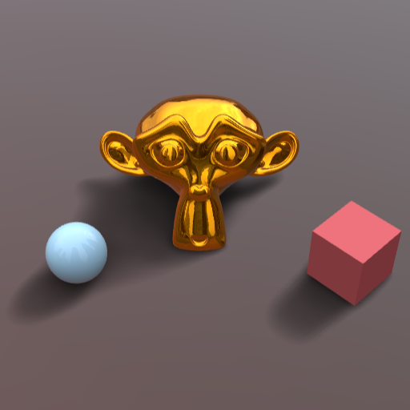
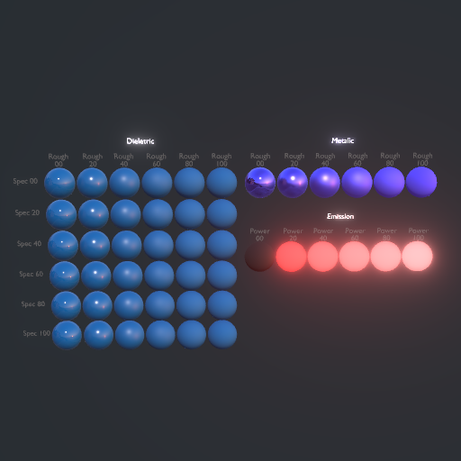

# Fantasy 3D 👋

<!--

**Here are some ideas to get you started:**

🙋‍♀️ A short introduction - what is your organization all about?
🌈 Contribution guidelines - how can the community get involved?
👩‍💻 Useful resources - where can the community find your docs? Is there anything else the community should know?
🍿 Fun facts - what does your team eat for breakfast?
🧙 Remember, you can do mighty things with the power of [Markdown](https://docs.github.com/github/writing-on-github/getting-started-with-writing-and-formatting-on-github/basic-writing-and-formatting-syntax)
-->

Fantasy 3D is a **web-first** real-time interactive 3d visualization framework base on [three.js](https://threejs.org). Use **ECS(Entity-Component-System)** design and easy to use and light weight.Can be used to develop **digital twins**, **digital city**, **digital factory**, **3D GIS**, ect.

Visit the [official website](https://fantasy3d.cn) for more information.

    
    

    
    

